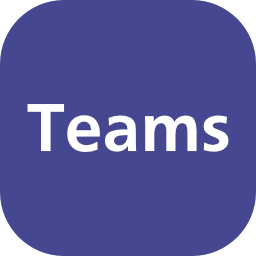

  

# Touch Portal MS-Teams Plugin

#### [Teams](https://www.microsoft.com/en-us/microsoft-teams) integration for [Touch Portal](https://www.touch-portal.com).

This Version is for Teams API 2. If you need the old Teams API 1, please use the [Plugin Version 1.0.1](https://github.com/L-C-P/TouchPortalTeamsPlugin/releases).
API 2 is supported in Teams 1 and 2.x. To check your Teams API version, open the "Third-Party App API" in the configuration. If you see "Allow apps or devices", your Teams is using API version 2.

You can control the following Team functions from Touch Portal:

- Mute and unmute
- Turn your camera on and off
- Blur or unblur your background
- Raise and lower your hand
- Send reactions (Applause, Laugh, Like, Love)
- Leave a meeting

In addition, you will find the following states in Touch Portal:

- Plugin is connected to Teams / Teams is running
- Plugin is paired
- Microphone state (on/off)
- Camera state (on/off)
- Hand raised
- Is active Teams meeting
- Recording state
- Background blurred state
- Screen/App sharing state
- Has unread messages state
- You can change the microphone state
- You can change the camera state
- You can raise your hand
- You can change the background blurred state
- You can change the record state
- You can leave the meeting
- You can send reactions
- You can toggle sharing
- You can toggle chat
- You can stop sharing
- You can pair

## Installation

- [Enable](https://support.microsoft.com/en-us/office/connect-third-party-devices-to-teams-aabca9f2-47bb-407f-9f9b-81a104a883d6) the third-party app API in Teams.
- Should work without any configuration.
- If you run Teams and Touch Portal on different computers, change "localhost" to the corresponding DNS name or IP address of the computer on which Teams is running.

## Credits

Developed by [Denis Sowa](https://github.com/L-C-P) with :heart:

[Touch Portal .Net SDK](https://github.com/oddbear/TouchPortalSDK) is developed by [Oddbjørn Bakke](https://github.com/oddbear)